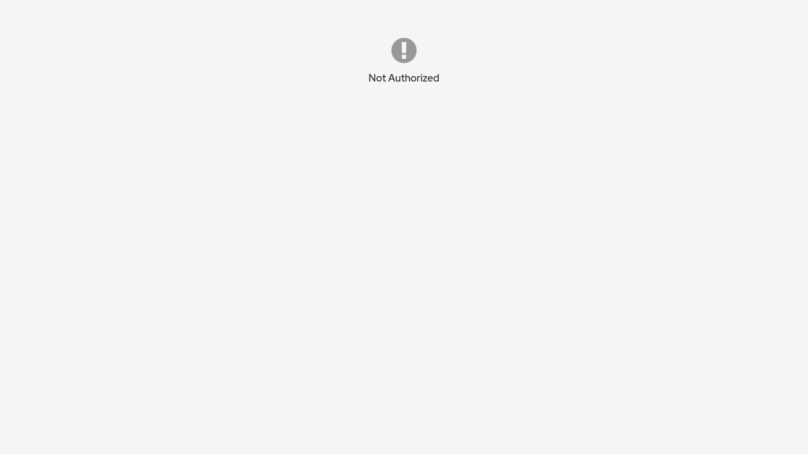
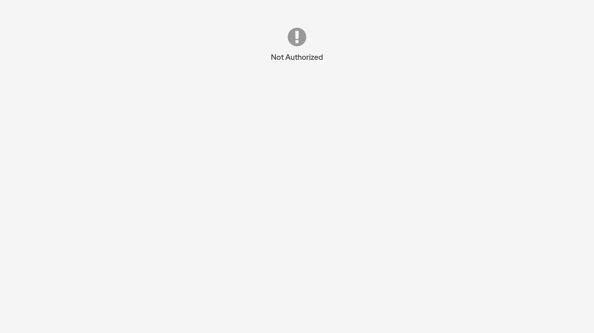

# IcePorge Cockpit Modules

**Web-based Management Interface for CAPE Sandbox and MWDB Stack**

Part of the [IcePorge](https://github.com/icepaule/IcePorge) Malware Analysis Stack.

[](LICENSE)

---

## Screenshots

### MWDB Stack Manager


*Manage MWDB-core services, Karton pipeline, and container health from a single dashboard.*

### CAPE Sandbox Manager


*Monitor CAPE services, VMs, and view logs with integrated health checks for external services.*

---

## Modules

### CAPE Manager (`cape-manager/`)
- CAPE service status monitoring
- VM management (libvirt)
- Log viewer with multiple sources
- Service restart controls
- External service health checks (MISP, Ghidra, Ollama)

### MWDB Manager (`mwdb-manager/`)
- MWDB Core services status
- Karton pipeline monitoring
- MWDB Feeder status and controls
- Feed source configuration overview
- Statistics dashboard
- Container management (start/stop/restart/rebuild)

## Installation

```bash
# Copy modules to Cockpit directory
sudo cp -r cape-manager /usr/share/cockpit/
sudo cp -r mwdb-manager /usr/share/cockpit/

# Restart Cockpit
sudo systemctl restart cockpit.socket
```

## Access

1. Open Cockpit: `https://your-server:9090/`
2. Login with administrator credentials
3. Enable "Administrative access" (required for Docker commands)
4. Select "CAPE Sandbox" or "MWDB Stack" from the menu

## Requirements

- Cockpit >= 215
- Administrative access enabled
- Docker installed (for container management)

## License

MIT License with Attribution - see [LICENSE](LICENSE)

Copyright (c) 2024-2026 IcePorge Project
- GitHub: [@icepaule](https://github.com/icepaule)
- Email: info@mpauli.de
